Class5 Data Exploration and Visualization in R
================
Shilpa Nath
2019-10-31

``` r
baby <- read.delim("bimm143_05_rstats/weight_chart.txt")
head(baby)
```

    ##   Age Weight
    ## 1   0    3.6
    ## 2   1    4.4
    ## 3   2    5.2
    ## 4   3    6.0
    ## 5   4    6.6
    ## 6   5    7.2

``` r
plot(baby$Age, baby$Weight)
```

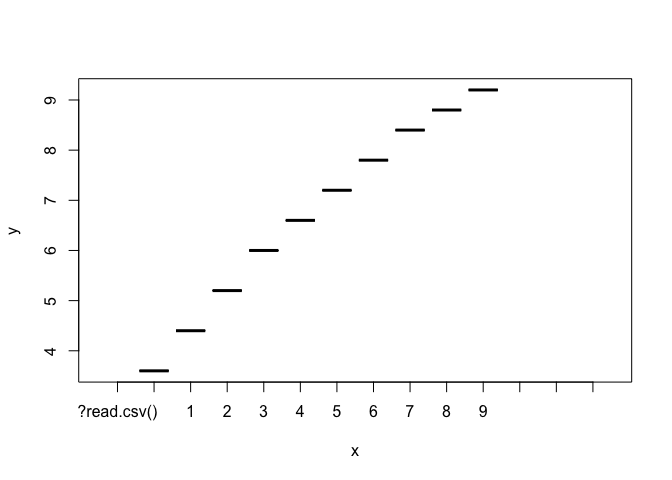<!-- -->

``` r
#plot(weight$Age, weight$Weight, typ="o")

plot(baby$Age, baby$Weight, typ="o", pch=15, cex=1.5, lwd=2, ylim=c(2,10),xlab="Age(months)", ylab="Weight(kg)", main="Baby weight with age", col="blue")
```

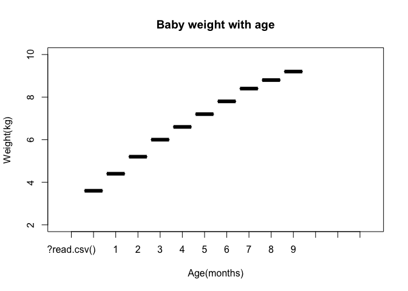<!-- -->

``` r
mouse <- read.delim("bimm143_05_rstats/feature_counts.txt")
barplot(mouse$Count)
```

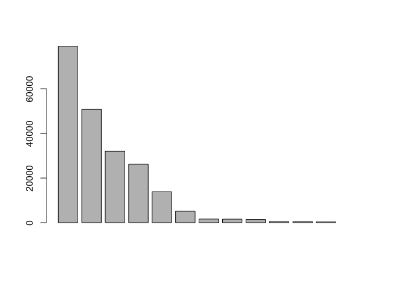<!-- -->

``` r
par(mar=c(5, 11, 5, 2))
#head(mouse)
barplot(mouse$Count, names.arg=mouse$Feature, horiz=TRUE, ylab="", main="Number of features in the mouse GRCm38 genome", las=1)
```

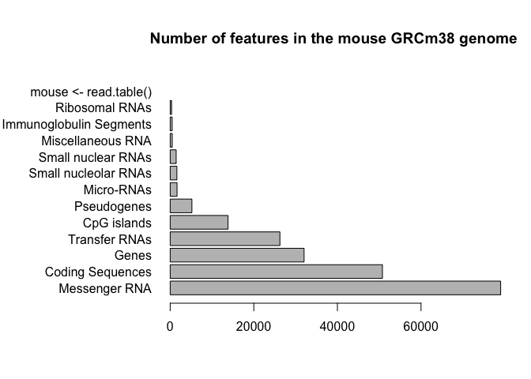<!-- -->

``` r
par(mar=c(5,11,2,2))
barplot(mouse$Count, names.arg = mouse$Feature, horiz = TRUE, ylab = "", main = "Number of features in the mouse GRCm38 genome", las=1, xlim=c(0,80000))
```

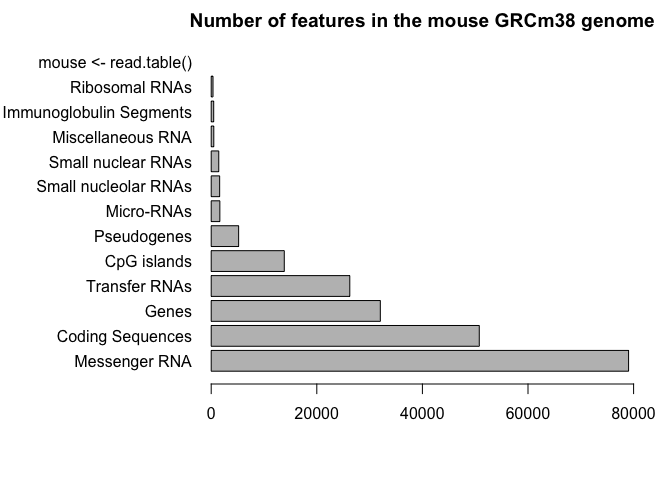<!-- -->

``` r
x <- c(rnorm(10000), rnorm(10000)+4)
hist(x, breaks=80)
```

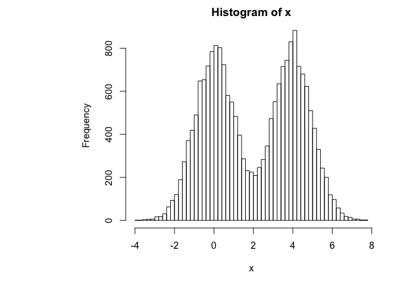<!-- -->

``` r
mf <-read.delim("bimm143_05_rstats/male_female_counts.txt")
head(mf)
```

    ##      Sample Count
    ## 1   D1 Male     2
    ## 2 D1 Female     1
    ## 3   D2 Male     2
    ## 4 D2 Female     3
    ## 5   D3 Male     3
    ## 6 D3 Female     6

``` r
barplot(mf$Count, names.arg = mf$Sample, col = rainbow(nrow(mf)), las=2, ylab = "Counts")
```

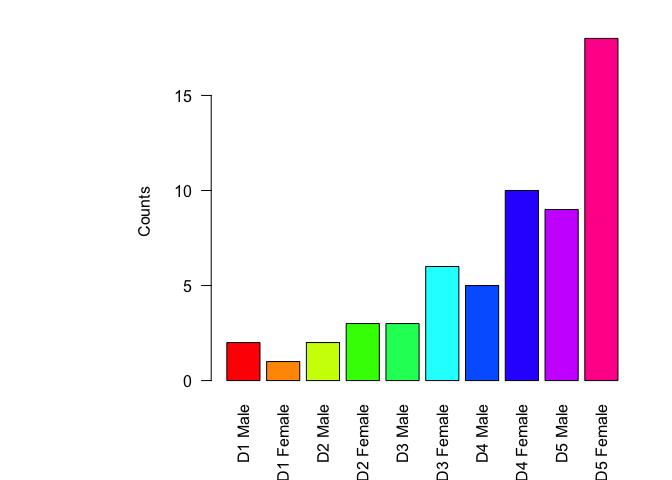<!-- -->

``` r
barplot(mf$Count, names.arg=mf$Sample, col=c("blue2", "red2"), las=2, ylab="Counts")
```

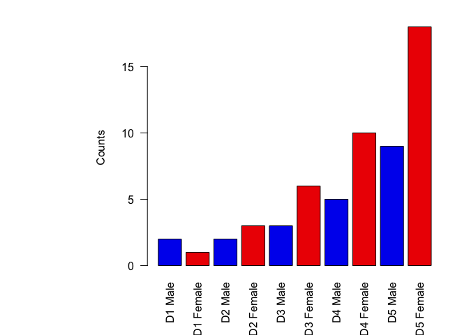<!-- -->

``` r
genes <- read.delim("bimm143_05_rstats/up_down_expression.txt")
nrow(genes)
```

    ## [1] 5196

``` r
table(genes$State)
```

    ## 
    ##       down unchanging         up 
    ##         72       4997        127

``` r
plot(genes$Condition1, genes$Condition2, col=genes$State, xlab="Expression condition 1", ylab="Expression condition 2")
```

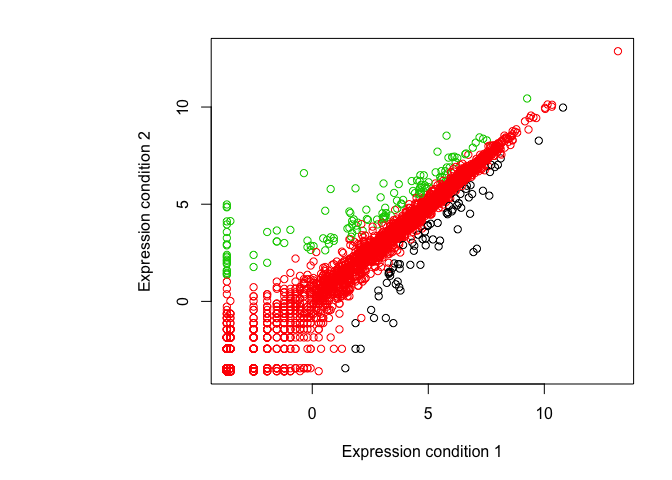<!-- -->

``` r
palette(c("blue", "gray", "red"))
plot(genes$Condition1, genes$Condition2, col=genes$State, xlab="Expression condition 1", ylab="Expression condition 2")
```

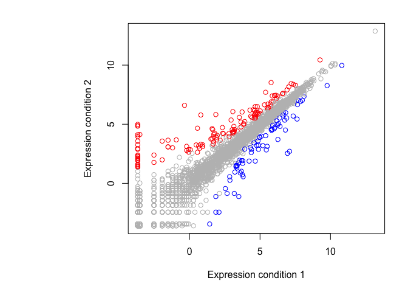<!-- -->

``` r
meth <- read.delim("bimm143_05_rstats/expression_methylation.txt")
nrow(meth)
```

    ## [1] 9241

``` r
plot(meth$gene.meth, meth$expression)
```

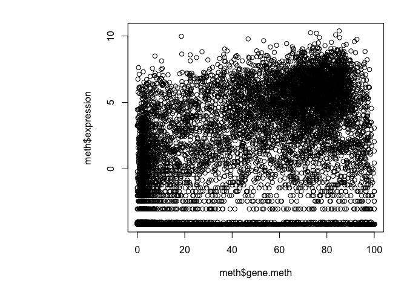<!-- -->
